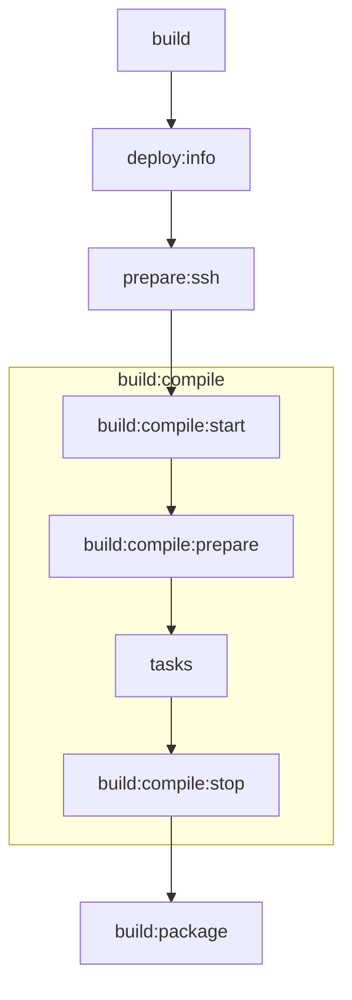
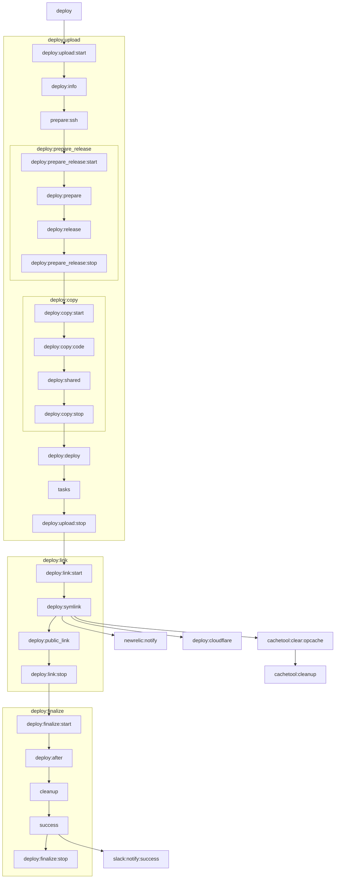

## Switching node version

```bash
source /etc/profile.d/nvm.sh
nvm install -s stable
```

## Tests

### Static tests
To run the static tests, please run the following commands:

```bash
composer --working-dir tools install
tools/vendor/bin/grumphp run --config tools/grumphp.yml
```

### Docker container
We use Google Container Structure Tests over https://github.com/aelsabbahy/goss because the Hipex deploy container does not require a health check.

## Build images locally

```bash
CONTAINER_IMAGE=hipex/deploy/dev \
CI_COMMIT_TAG=2.0.2 \
PHP_VERSION=7.4 \
NODE_VERSION=14 \
LOCAL_BUILD= \
./ci/build.sh
```

## Run with local image 

```bash
rm -Rf vendor
docker run --rm -it --env SSH_PRIVATE_KEY="$(cat ~/.ssh/id_rsa_mydeploykey | base64)" -v ${PWD}:/build hipex/deploy/dev:2.1.0-php7.3-node13 hipex-deploy build -vvv
```

## Architecture

Flow of `hypernode-deploy build`:



Flow of `hypernode-deploy deploy`:


